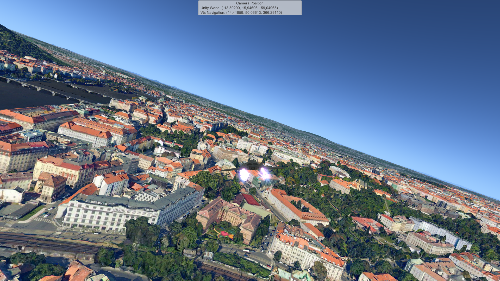

# Vts Jet Fighter

Example game with jet fighter flying over landscape and cities provided by Melown Technologies's VTS geospatial software stack.

The VTS plugin also proved an implementation of shifting origin - a technique
that allows to _shift_ the _real world_ to keep the player close enough to the origin of the _unity world_,
which allows the player to fly over the entire globe.

The _real world_ coordinates as well as _unity world_ coordinates of the camera are shown on top of the screen.

# Building

Either download and install the VTS plugin from Asset Store:
https://assetstore.unity.com/packages/tools/terrain/vts-landscape-streaming-plugin-125885

Or clone and build the VTS plugin from sources:
https://github.com/melowntech/vts-browser-unity-plugin

Please note, this example game is developed together with the plugin and therefore it may depend on some features of the VTS plugin that are not yet published to the store, or vice-versa.
